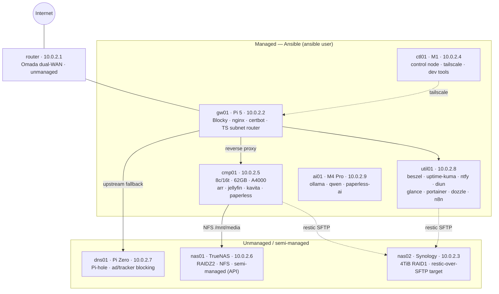

# Architecture

Target-state design for the v3 homelab. This is the design; see
[`../plan/roadmap.md`](../plan/roadmap.md) for how far along the build is.

Verified against the live network on 2026-08-21 (port/DNS/NFS probes + SSH). Where this
doc and [`../../hosts/hosts.yml`](../../hosts/hosts.yml) disagree, the inventory wins.

## Network

| | |
|---|---|
| Subnet | `10.0.2.0/24` |
| Router | `10.0.2.1` — Omada, dual-WAN load share (ACT Fibernet + Airtel Black), unmanaged |
| Controller | `10.0.2.21` — Omada controller, unmanaged |
| Primary DNS (DHCP) | `10.0.2.2` (Blocky on `gw01`) |
| Secondary DNS (DHCP) | `10.0.2.7` (Pi-hole on `dns01`) |
| Base domain | `puhome.net` (Cloudflare-hosted — enables DNS-01 wildcard TLS) |
| Host FQDN scheme | `<name>.host.puhome.net` |
| Service FQDN scheme | `<service>.puhome.net`, reverse-proxied by nginx on `gw01` |
| Remote access | Tailscale; `gw01` is the subnet router advertising `10.0.2.0/24` |

Static IP assignment is done in the Omada controller (DHCP reservation), not on the hosts.
`ctl01` still holds a dynamic lease (`10.0.2.115`) and needs a reservation at `10.0.2.4`.

## DNS design

Blocky and Pi-hole have **distinct jobs** — this is deliberate, not redundant:

- **Blocky (`gw01`)** — authoritative for local names. Resolves `*.puhome.net` and
  `*.host.puhome.net` from the inventory, so local services (and Tailscale clients) resolve
  by name. It does **not** run blocklists.
- **Pi-hole (`dns01`)** — the actual ad/tracker blocker for the network.

```
DHCP advertises:  primary 10.0.2.2 (Blocky) · secondary 10.0.2.7 (Pi-hole)

Blocky @gw01
  *.puhome.net            → answered locally (mapping generated from inventory)
  everything else         → upstream group, strict order:
                              1. Pi-hole (10.0.2.7)   ← blocking happens here
                              2. Quad9 DoH            ← fallback if Pi-hole is down

Pi-hole @dns01
  puhome.net              → conditional-forward to 10.0.2.2 (Blocky)   ← see note
  everything else         → DoH upstream + gravity blocklists
```

Three correctness requirements baked into the roles:

1. **Blocky needs a fallback upstream.** Without it, a dead Pi Zero takes down all DNS.
   With Quad9 as a second `strict`-ordered upstream, a Pi-hole outage degrades to "ads
   return", not "no internet".
2. **Pi-hole needs a conditional forward for `puhome.net → 10.0.2.2`.** Clients pick either
   advertised resolver arbitrarily; without this, local names silently fail for whoever
   lands on the secondary. (Not configured on `dns01` today — a build task.)
3. **Blocking stays off in Blocky.** Pi-hole owns blocking; running blocklists in both
   splits stats and whitelists across two UIs.

Tailscale split-DNS maps `puhome.net → 10.0.2.2` so local names resolve remotely.

## Access model

Three distinct planes, deliberately independent so a failure in one never locks out another:

- **End users → services: Single Sign-On via Authentik.** Every user-facing service sits
  behind one identity provider (Authentik on `util01`, `auth.puhome.net`), enforced by nginx
  forward-auth on `gw01`. One login, one credential set, one MFA policy — no per-app logins.
  See [`auth.md`](auth.md).
- **Admin → hosts: the `ansible` service account.** All managed hosts are administered through
  a single `ansible` account (`system/ansible_user`, key `keys/ansible_rsa.private`). SSH is
  key-based and **independent of Authentik** — a broken SSO never locks you out of the fleet
  (break-glass). `uknth` remains a personal admin login on each host, unified onto one public
  key across the fleet (see [`conventions.md`](conventions.md#unified-uknth-login)).
- **Remote access: Tailscale on `gw01` only.** `gw01` is the **sole** Tailscale node, running
  as a subnet router advertising `10.0.2.0/24` with split-DNS `puhome.net → 10.0.2.2`. No other
  host runs Tailscale — the subnet router reaches the whole fleet. `ctl01` (Mac Mini M1) is the
  Ansible **control node**, reached over that subnet route.
  - **Key expiry is disabled** for gw01 directly in the admin console, so the subnet router
    stays permanently connected. (The auth key's own 90-day expiry then only matters for
    *re-registering* a node, never for staying online.) The role also supports advertising an
    ACL tag (`tailscale_tags`) — tagged devices are expiry-exempt too — but that's unused
    since the direct toggle is available.
  - gw01 also advertises itself as an **exit node** (`tailscale_advertise_exit_node: true`),
    so you can route internet traffic through home when remote. Approved in the admin console
    alongside the subnet route.
- **Onboarding a host:** run `init.yml` (idempotent — creates the `ansible` account, skips when
  already done). See [`conventions.md`](conventions.md#bootstrapping-a-new-host).

## Storage

See [`storage.md`](storage.md) for the full design. Summary:

- **`nas01` (TrueNAS, RAIDZ2)** — primary storage. NFS is live on `10.0.2.6:2049`. Exports a
  single `media` dataset consumed by `cmp01` as one mount at `/mnt/media`.
- **`nas02` (Synology, 4 TiB RAID1)** — backup target. **NFS is disabled**; it runs SMB + SSH.
  Restic writes to it over **SFTP**.
- **Golden rule:** service *state* (SQLite/Postgres) lives on `cmp01`'s local NVMe; only bulk
  *media* lives on NFS. SQLite over NFS corrupts — this is the most common way an arr stack dies.

`nas01` is **semi-managed**: Ansible drives its NFS exports through the TrueNAS REST API but
does not otherwise configure it. `nas02` is unmanaged (Restic targets it as an external repo).

## Topology



## Design principles carried into v3

- **One host, one clear purpose.** `cmp01` = compute/GPU; `util01` = observability/ops;
  `gw01` = network edge; `ctl01`/`ai01` = the two Macs (control/dev vs. AI).
- **State local, media remote.** Never put a database on NFS.
- **Everything reverse-proxied through `gw01`.** `<service>.puhome.net` always routes through
  nginx; no service is reached directly on a host port for normal use.
- **Notify, don't auto-mutate.** Updates and backups notify (Diun, ntfy); changes are applied
  by re-running idempotent Ansible, not by containers updating themselves. See
  [`maintenance.md`](maintenance.md).
- **Cross-platform system roles.** `roles/system/*` branch on `ansible_system` rather than
  forking per-OS — see [`conventions.md`](conventions.md).
